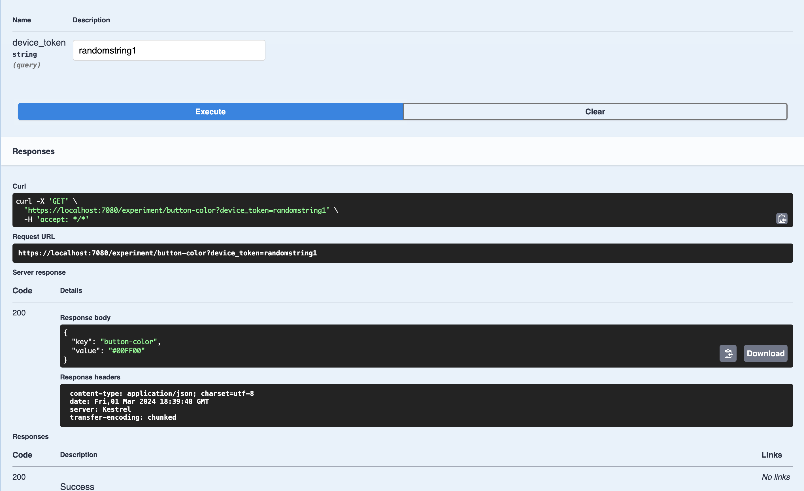
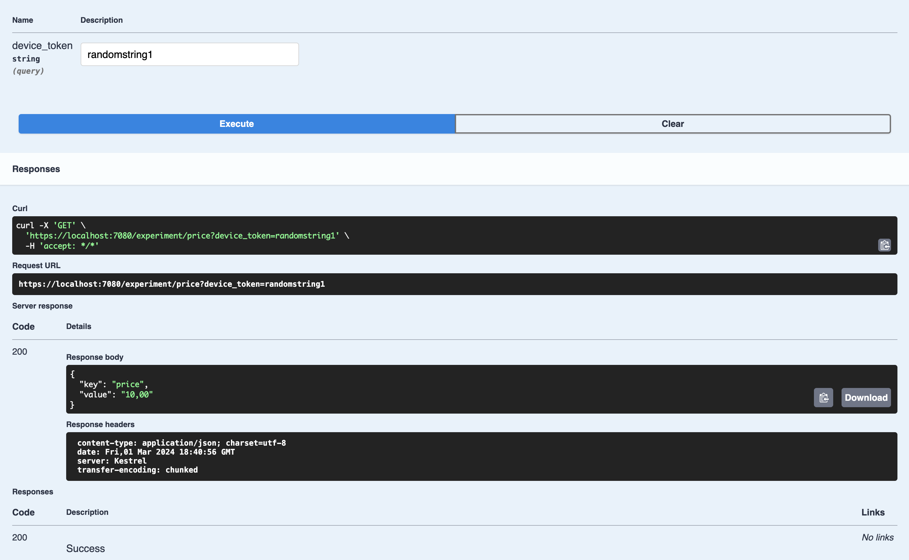
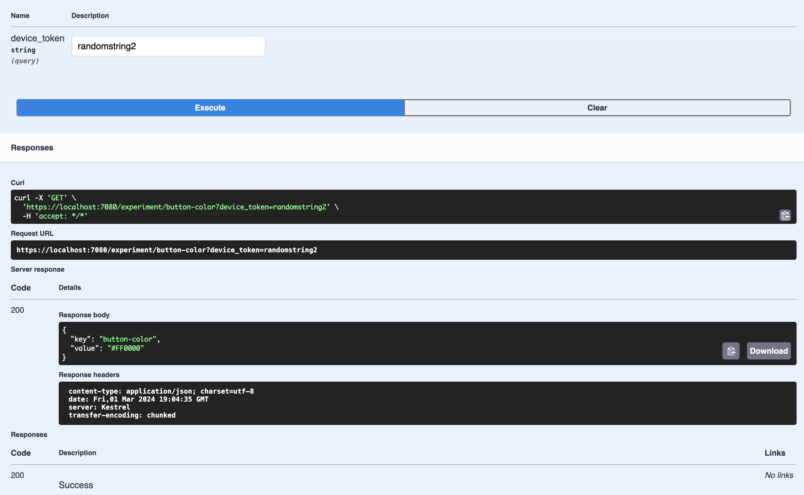
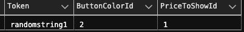
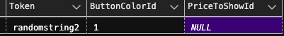
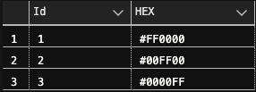
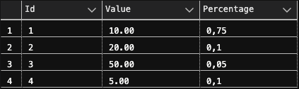
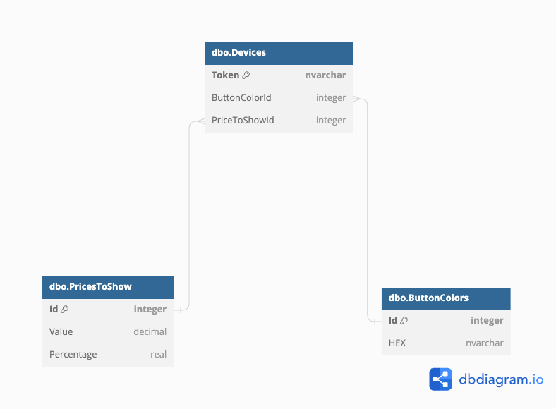

# 💡 ABPBackendTZ

✅ Зміст:

- **[Завдання](#завдання)**
- **[Юзкейси](#результат-юзкейси)**
- **[SQL-діаграма](#sql-діаграма-структура-бази-даних)**
- **[Статистика](#статистика-повні-результати-можна-подивитись-тут)**

## Завдання

полягало в наступному: Розробити два експерименти для користувачів, де умовно потрібно визначити:

- Як колір кнопки «купити» впливає на конверсію на покупку
- Як зміна вартості покупки в додатку може вплинути на маржинальний
  прибуток.

Для цього мені потрібно було розробити додаток (Web API), який б із визначеною вірогідністю давав користувачам колір кнопки та різні ціни на продукт, коли вони вводили _device-token_. При цьому, сам клієнт у відповідь отримує ключ експерименту, та саме значення

При цьому, юзер не мав дізнатися про проведення експериментів і ті кнопка, та ціна, які в нього були мають залишатися незмінними.

## Результат (Юзкейси)

1. Записуємо новий девайс до обох експериментів (**button-color** | **price**) і отрмуємо значення:
<p>
    
</p>

<p>
    
</p>

\*При повторному вводі значень відповідь не змінюється

2. Введемо інше значення девайсу і подивимося, чи є відмінності? (Спойлер: є)
<p>
    
</p>

3. Дивимося, що маємо в базі даних:
<p>
    
</p>
<p>
    
</p>

4. Запевняємося, чи дійсно Id **button-color** | **price** правильні, звіряючи зі значеннями, наведеними вище:
<p>
    
</p>
звіривши id і перевіривши hex ми бачимо, що колір дійсно правильний.
<p>
    
</p>
така ж ситуація і з цінами.

## SQL-діаграма (структура бази даних)

<p>
    
</p>

## Статистика ([Повні результати можна подивитись тут](./ABPBackendGetStatistics/))

1. 200, 600, 1000 девайсів для **button-color** відповідно:

```json
  "values_counter": {
    "#FF0000": 73,
    "#00FF00": 77,
    "#0000FF": 50,
    "Total": 200
  }
```

```json
  "values_counter": {
    "#FF0000": 198,
    "#00FF00": 200,
    "#0000FF": 202,
    "Total": 600
  }
```

```json
  "values_counter": {
    "#FF0000": 328,
    "#00FF00": 337,
    "#0000FF": 335,
    "Total": 1000
  }
```

2. 200, 600, 1000 девайсів для **price** теж відповідно :D :

```json
  "values_counter": {
    "50,00": 7,
    "20,00": 17,
    "10,00": 159,
    "5,00": 17,
    "Total": 200
  }
```

```json
  "values_counter": {
    "50,00": 24,
    "20,00": 53,
    "10,00": 459,
    "5,00": 64,
    "Total": 600
  }
```

```json
  "values_counter": {
    "50,00": 47,
    "20,00": 102,
    "10,00": 758,
    "5,00": 93,
    "Total": 1000
  }
```

Відношення отриманих значень та вірогідностей збігаються на відмінно, як в **button-color**, так і в **price**
